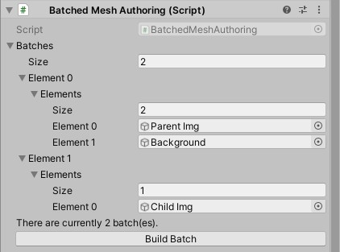

# Canvas

Canvases are small entities which contain a dynamic buffer of children entities. The primary role of the Canvas is to
manage the scale of the canvas such that the UI displays at a proper scale regardless of screen size.

## CanvasConversionSystem
All canvases that are either in a subscenes or have the `ConvertToEntity` trigger will have the following components
attached to them:

|Component | Description |
|:---------|:------------|
| RootVertexData | Stores all of the vertex data of all Images and Text children |
| RootTriangleIndexElement | Stores all of the indices of all Image and Text children |
| RenderElement | Stores children entities which are part of the batch |
| BatchedSpanElement | Stores the start index of the first entity in the batch, and the number of elements in the batch |
| SubMeshKeyElement | Stores texture and material keys of each submesh - used to grab the actual textures and materials from the Bins |
| SubMeshSliceElement | Stores the start index and length of each submesh's vertices and indices, this helps describe the submesh boundaries for rendering |
| Child | Stores all children of the canvas in breadth first fashion |
| CanvasSortOrder | Determines the render order of the Canvas, canvases with lower priority are rendered first. |
| WidthHeightRatio | If the canvas is set to scale with screen size, then the canvas follows a logarithmic curve if the current resolution does not match the reference resolution. |
| BatchCanvasTag | Marks the canvas' indices and vertices as invalid and need to be adjusted (shifted/rebuilt) |
| BuildCanvasTag | Marks that the canvas' submeshes have to be rebuilt |
| AddMeshTag | Marks that the canvas needs to have a managed Mesh component |
| MaterialPropertyBatch | Contains a collection of material collections to render. |

## Limitations

Currently, canvases that use ***Constant Pixel Size*** and ***Constant Physical Size*** are not supported.

## Building the Canvas
Build the canvas is a multi step process - which will be covered over the course of the next few frames.

***This is experiemental and will likely change in the near future.****

1. Children entities must be marked to be built.
  a. `BuildImageVertexDataSystem` and `BuildTextVertexDataSystem` will run if there is a `BuildUIElementTag` on the entity.
    This allows local vertex data to be built.
  b. Those systems will recurse to the root canvas and mark that the canvas has to consolidate all children elements 
    by adding the `BatchCanvasTag`.
2. Canvases that have the `BatchCanvasTag` recurse through the children and build the `RootVertexData` and 
`RootTriangleIndexElement` together.
  a. After processing these canvases, the canvas is then marked to be built using the `BuildCanvasTag`
3. Canvases marked with the `BuildCanvasTag` have their `RootVertexData` and `RootTriangleDataElement` copied into its
 associative Mesh.
  a. Subsequently the `BatchedCanvasTag` is removed and the mesh is prepared for rendering

Meshes are batched and made up of various submeshes similar to Unity's default UI system. This allows meshes with the 
same material and texture to be constructed together and issued with a single draw call.

To see how meshes and submeshes are built - please see the `BatchCanvasMeshSystem` and `BuildCanvasMeshSystem`.

## Rendering

Similar to UGUI - canvases are typically the primary renderers - meaning that all children of the Canvas potentially
have render information that should be passed to the Canvas. This means that all images and text components are
typically not renderers - but are suppliers of vertex and index information to the Canvas.

The canvas will have a managed `Mesh` component added via the `AddMeshTag`. The `AddMeshSystem` finds all canvas archetypes, 
consume the `AddMeshTag`, and subsequently add the managed Mesh to the Canvas.

### Why do this?
The theory behind this is that we can store many canvases into a particular chunk - alongside the mesh data. This allows
a singular archetype to be queried and read simply iterating on all the chunks instead of jumping between archetypes to
render the UI.

## Batching
Like Unity's UI, canvases are batched on editor time and this information is stored on the root canvas. Without specifiying 
a batch, the canvas _will_ not render. The `BatchedMeshAuthoring` component is responsible for building the mesh.

For **simplicity**, the `Build Batch` button will build the batch automatically. This will batch elements together that use 
the same texture and the same material.

There are _**limitations**_ to batching, please see information about [shaders](Shaders.md).

An example of the `BatchedMeshAuthoring` component.

## Recomputating the Canvas
Generally, the canvas should _only_ be rebuilt if you need to add more elements to the UI or if the resolution of the 
screen changes.
